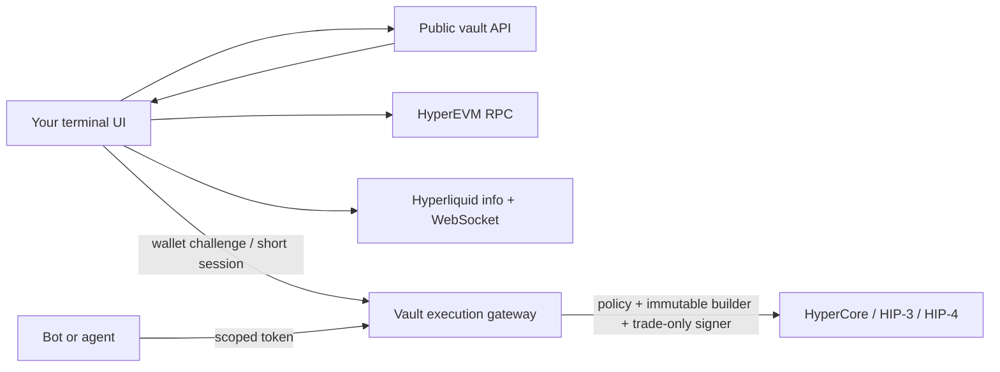

# Integrate Omni vaults into another terminal

This is the zero-to-one path for adding public vault discovery, follower
deposits/redemptions, manual leader trading and automated trading to an
existing Hyperliquid front end.

> Current status: testnet preview. A terminal must visibly label non-authoritative
> NAV and disabled transactions. Do not present this integration as mainnet-ready.

## Architecture and trust boundary



Your terminal owns presentation, wallet connection and transaction consent.
The public SDK owns request shapes and validation. The gateway owns the
vault-to-leader binding, risk policy, builder injection and trade-only signing.
Neither SDK contains custody keys. Never send a leader private key, follower
private key or x402 payer key to Omni.

## 1. Install

TypeScript (Node 20+ or a modern browser):

```bash
npm install github:InTheta/hl-vault-sdk
```

Python 3.11+ (until a registry release):

```bash
git clone https://github.com/InTheta/hl-vault-sdk.git
python -m pip install -e ./hl-vault-sdk/python
```

## 2. Discover, never hard-code

Fetch `GET /v1/integration/manifest` from the configured public API root. Check:

- `schema` is the supported v1 URI;
- `release_stage` and `network.name` match the terminal environment;
- `transactions_enabled` before displaying deposit/redeem buttons;
- `security.nav_authoritative` before labeling reported TVL/PnL authoritative;
- contract and execution addresses come from the manifest, not URL parameters.

TypeScript:

```ts
const terminal = await VaultTerminalClient.connect({ vaultApiUrl });
const list = await terminal.public.vaults();
const dashboard = await terminal.dashboard(list.vaults[0].address);
```

If the chosen deployment is protected at the edge, server integrations may
pass approved headers with `headers`. They are applied to Omni API/gateway
requests and intentionally never forwarded to Hyperliquid. Browser integrations
must use an explicitly registered HTTPS origin; do not embed service tokens.

## 3. Build the vault workspace

Use one workspace with three clearly separated modes:

1. **Explore**: name, leader, TVL, followers, PnL, drawdown, builder status and
   reconciliation badge from the public API.
2. **Follow**: wallet balance, shares, pending deposit, pending redemption,
   claimable state and lock expiry from batched HyperEVM reads.
3. **Lead**: the normal order ticket, but with a persistent “Trading vault
   0x… / Personal account” scope control and policy/builder disclosure.

`dashboard()` combines indexed summary/performance with direct Hyperliquid
positions, balances and open orders. Use `stream()` for live account events,
then periodically refresh the HTTP snapshot to recover missed messages.

## 4. Follower lifecycle

Deposits and redemptions are asynchronous:

```text
approve asset -> request deposit -> operator settles epoch -> claim shares
request redeem -> lock/epoch settles -> claim assets
```

Render every state explicitly; never turn a submitted request into an immediate
“deposited” balance. See [FOLLOWER_LIFECYCLE.md](FOLLOWER_LIFECYCLE.md).

## 5. Manual leader trading

Request a challenge, have the connected leader wallet sign its exact EIP-191
message, exchange it for a vault-bound 15-minute session, and keep the token in
memory only. The standard order ticket can then call `placeOrder`, batch,
cancel, reduce-only close or managed TWAP. See
[MANUAL_TRADING.md](MANUAL_TRADING.md).

## 6. API and agent trading

The leader signs a grant containing scopes, markets, notional, taker permission
and an expiry of at most one hour. Give only its opaque returned token to the
bot. Use separate credentials for Omni read-only data and x402 payments. See
[API_AND_AGENT_TRADING.md](API_AND_AGENT_TRADING.md).

## 7. Failure and retry rules

- Generate one UUID client order ID per trading intent. Persist and reuse it
  after an ambiguous timeout; a new UUID means a new order.
- On disconnect, reconnect and resubscribe, then fetch an account/open-order
  snapshot before enabling new writes.
- Treat 401/403 as a stopped session, not a retry loop.
- Back off 429 and 5xx responses with jitter. Do not retry validation 4xx.
- Cancel-all is the first recovery action. Closing exposure must be reduce-only.
- Do not calculate follower balances from fill events; contract accounting is
  the source for shares and pending claims.

## 8. Launch checklist

- Contract, network and gateway originate from a valid manifest.
- Personal/vault trading scope is always visible.
- Wallet challenge text is signed exactly and the bearer stays in memory.
- Deposits show asset approval plus asynchronous request/claim states.
- Every order has a stable client order ID and explicit slippage/TIF.
- Positions and orders recover from a fresh HTTP snapshot after reconnect.
- Builder address/fee match `capabilities()`; the caller cannot override them.
- Funding, withdrawals, transfers, agent-key management and arbitrary exchange
  actions are absent from the public trading surface.
- Tests in [TESTING.md](TESTING.md) pass against mocks before testnet smoke tests.

The OpenAPI subset in `openapi/v1.yaml` and manifest schema in
`schemas/integration-manifest-v1.schema.json` are language-neutral integration
contracts. Unknown response properties must be ignored for forward compatibility.
